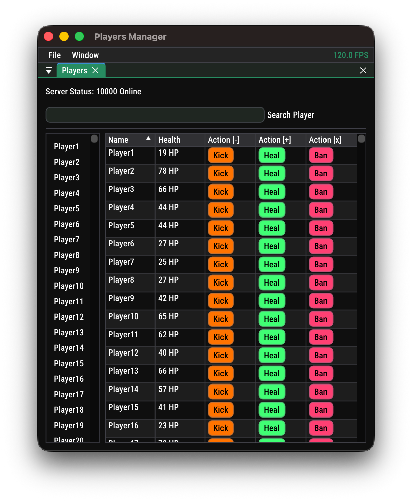
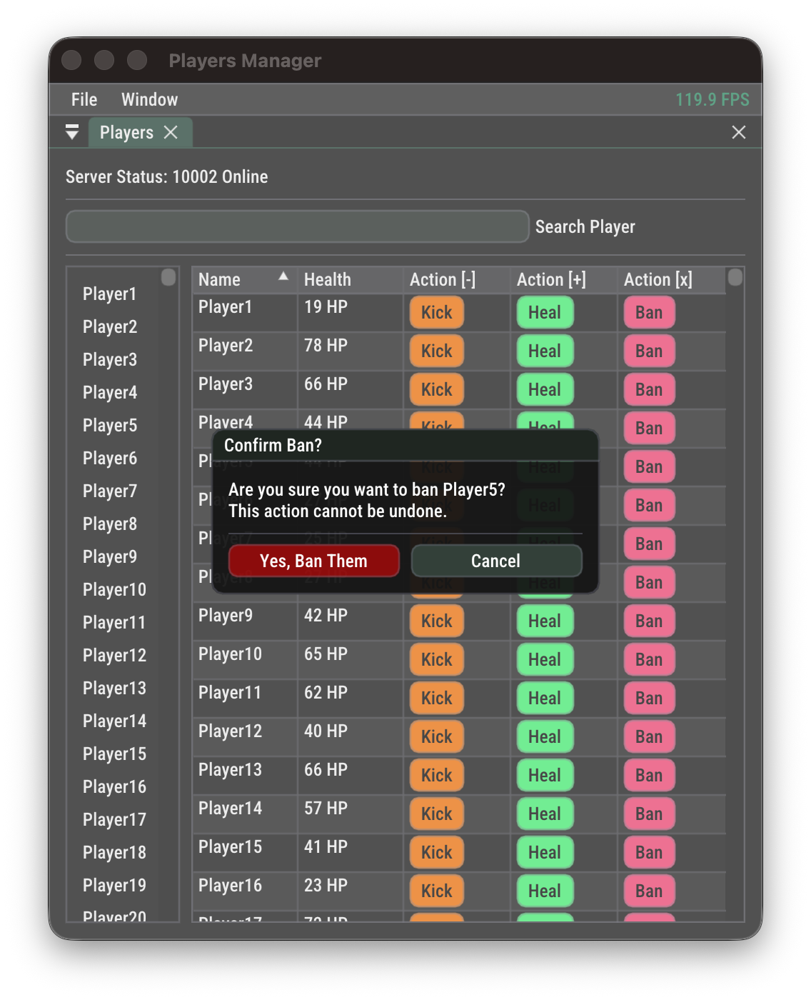
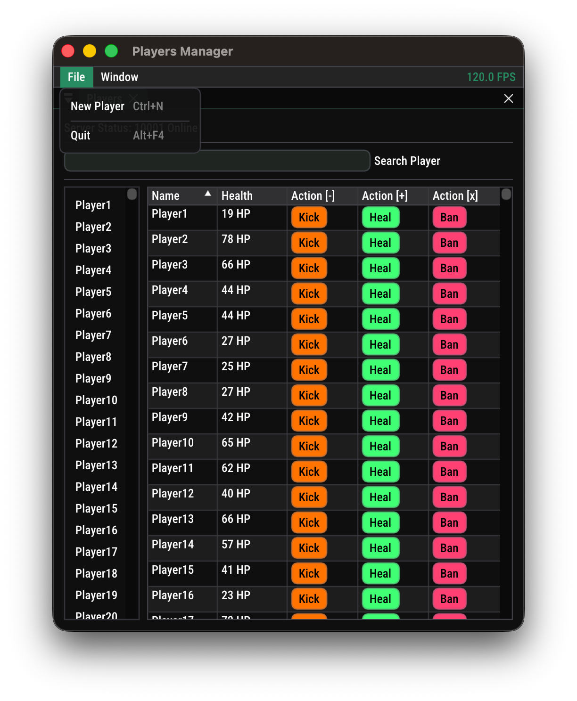
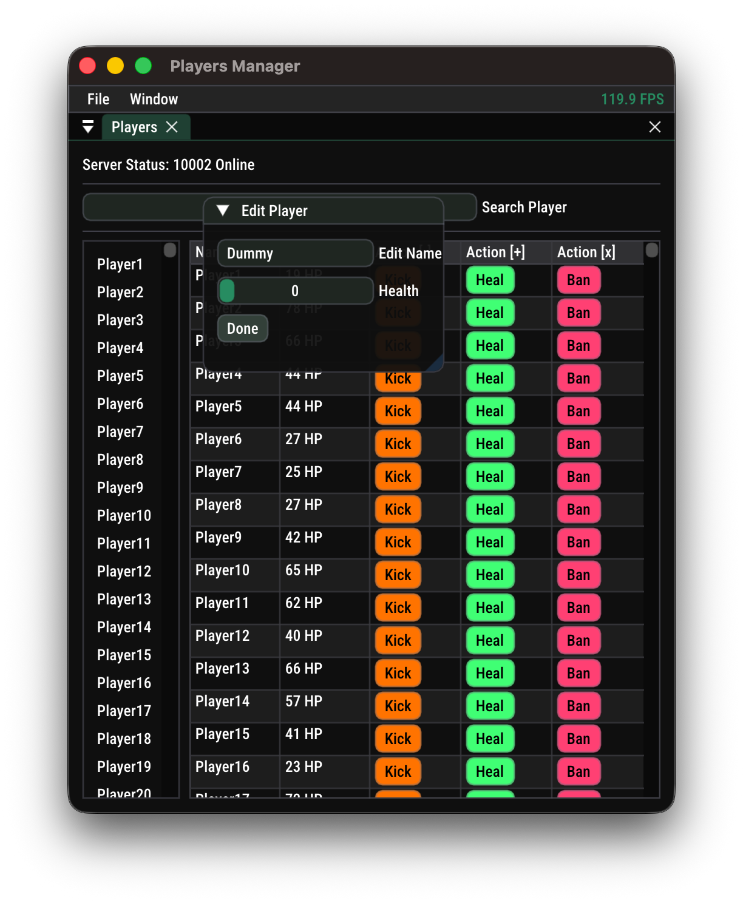

# Graphite

Graphite is a personal learning project built to explore **Dear ImGui** and modern **C++ application architecture**.  
It serves as a lightweight framework for building desktop applications using ImGui, and acts as the foundation for future projects.

The project focuses on:

- Learning and structuring an **ImGui-based application framework**
- Supporting **cross‑platform rendering backends**
- Creating reusable **application, rendering, and logging infrastructure**

---

## Features

- **Dear ImGui based UI framework**
- **Cross‑platform rendering**
  - **Metal** on macOS
  - **Vulkan** on Linux and Windows
- Modular architecture
- Simple **layer-based application system**
- Built‑in logging system
- Plugin experimentation support
- Example demo applications

---

## Rendering Backends

| Platform | Backend |
| -------- | ------- |
| macOS    | Metal   |
| Linux    | Vulkan  |
| Windows  | Vulkan  |

The renderer abstraction selects the appropriate backend depending on the platform.

---

## Project Structure

```
src
├── Core
│   ├── Application
│   │   ├── Renderer
│   │   │   ├── Backends
│   │   │   │   ├── Metal
│   │   │   │   └── Vulkan
│   │   ├── TGraphiteApplication.hpp
│   │   └── WindowConfiguration.hpp
│   ├── Common
│   │   ├── DynamicLibrary
│   │   └── UniqueID
│   └── Logger
├── demo
│   ├── BasicTableApp
│   ├── Calculator demo
│   ├── Playground
│   └── Plugin experiment
├── main.cpp
└── project
    ├── PlayersApplication
    └── Layers
```

### Core

Contains the reusable engine components:

- **Application** – window creation, renderer abstraction, layer management
- **Renderer** – platform-specific rendering implementations
- **Common** – shared utilities like dynamic library loading and unique IDs
- **Logger** – structured logging utilities with formatting support

### Demo

Contains various experiments and learning examples built using the framework:

- Basic UI experiments
- Calculator demo
- Playground for testing ideas
- Plugin loading experiments

### Project

A sample application built on top of Graphite demonstrating how the framework can be used to build a real tool, here just a dummy players management with tabular display and actions like updating data, healing, kicking and banning them.

---

## Build System

Graphite uses **CMake** and supports **cross‑platform builds**.

Example build:

```
mkdir build
cd build
cmake -G Ninja -DCMAKE_BUILD_TYPE=Debug ..
ninja graphite
./lib/graphite     # linux/macOS
./lib/graphite.exe # windows
```

---

## Goals

Graphite is not intended to be a full engine for now. Instead, it focuses on:

- Learning ImGui internals
- Experimenting with rendering backends
- Building a reusable UI application skeleton
- Serving as a base for future desktop tools

---

## Gallery






## License

This project is licensed under the **MIT License**. See the `LICENSE` file for details.
